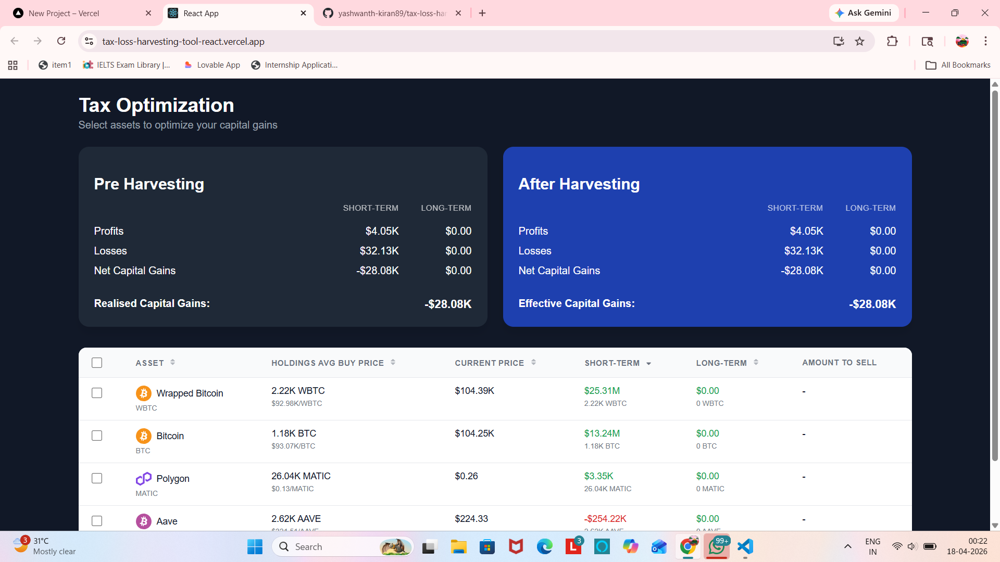
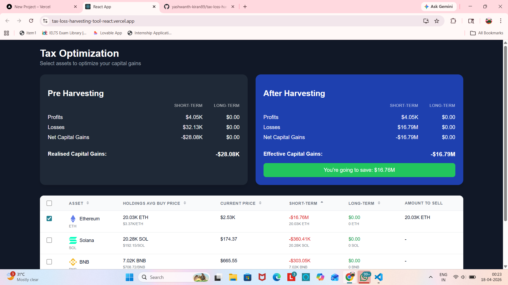
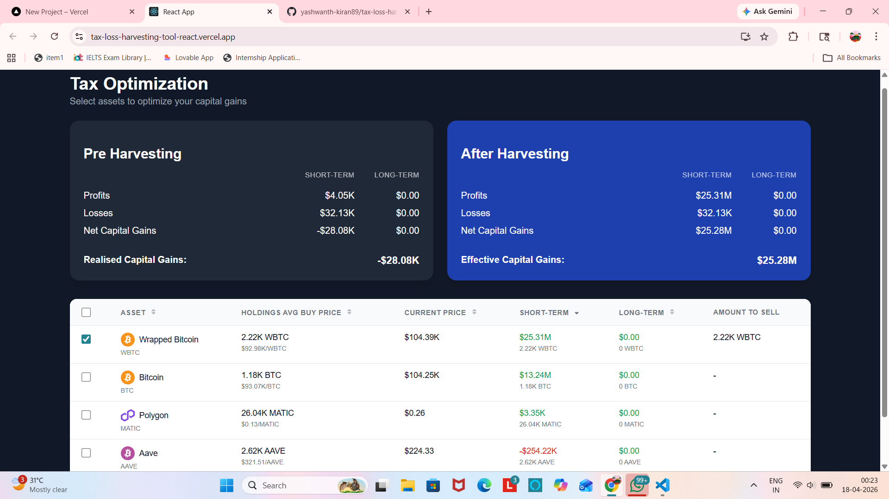

# Tax Loss Harvesting Tool

A responsive React application that helps users optimize capital gains by selecting assets to harvest tax losses. Built as part of the KoinX Frontend Intern Assignment.

## Features

- Pre-Harvesting and After-Harvesting cards displaying profits, losses, net capital gains, and realised/effective capital gains.
- Selectable holdings table with checkbox selection and "Select All" option.
- Real-time updates to the After-Harvesting card when assets are selected.
- Savings message shown when post-harvesting gains are lower than pre-harvesting gains.
- Sortable columns – click any column header to sort ascending or descending with visual arrows.
- "View All" button to toggle between showing 4 rows or all holdings.
- Fully responsive design – works on desktop, tablet, and mobile.
- Styled with styled-components using a clean, professional UI and Roboto font.
- Number formatting – large values displayed as K (thousands) and M (millions).

## Tech Stack

- React (Create React App)
- styled-components for styling
- react-icons for cryptocurrency logos
- Context API for state management

## Setup Instructions

### Prerequisites

- Node.js (v14 or higher)
- npm or yarn

### Installation

1. Clone the repository:
   ```bash
   git clone https://github.com/yashwanth-kiran89/tax-loss-harvesting-tool-react.git
   cd tax-loss-harvesting-tool  

2. Install dependencies: 
    ```bash
    npm install

3. Start the development server:
    ```bash
    npm start

4. Open http://localhost:3000 in your browser.


## Assumptions

- Mock APIs are used with `setTimeout` to simulate network delay, as explicitly permitted by the assignment requirements.
- All holdings and capital gains data are hardcoded based on the provided screenshots from the assignment.
- Long-term gains are zero in the provided data, but the application logic correctly handles both positive and negative values for long-term gains.
- Savings message is displayed only when `Pre-harvesting Realised Gains` is greater than `Post-harvesting Realised Gains`. The savings amount is the difference between the two.
- Number formatting uses `K` for thousands and `M` for millions, rounding to two decimal places (e.g., $16.76M, $360.41K).


## Live Demo
https://tax-loss-harvesting-tool-react.vercel.app/


## Author
Guvva Yashwanth Kiran – github.com/yashwanth-kiran89 


## ScreenShots 

  